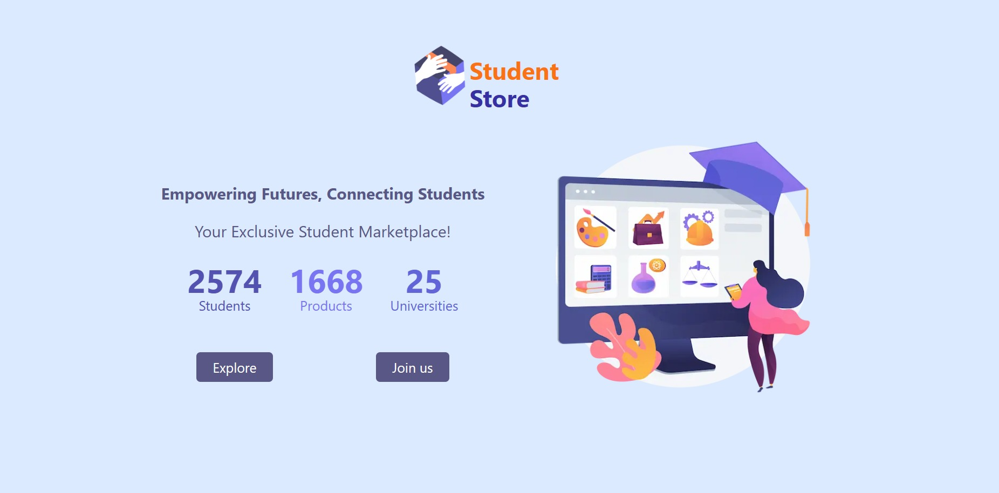
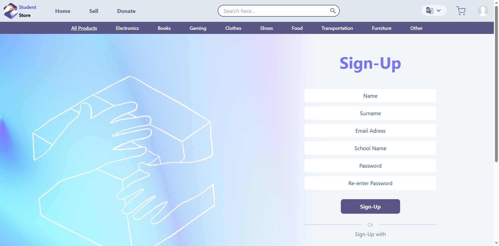
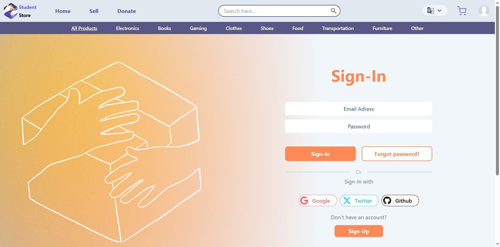
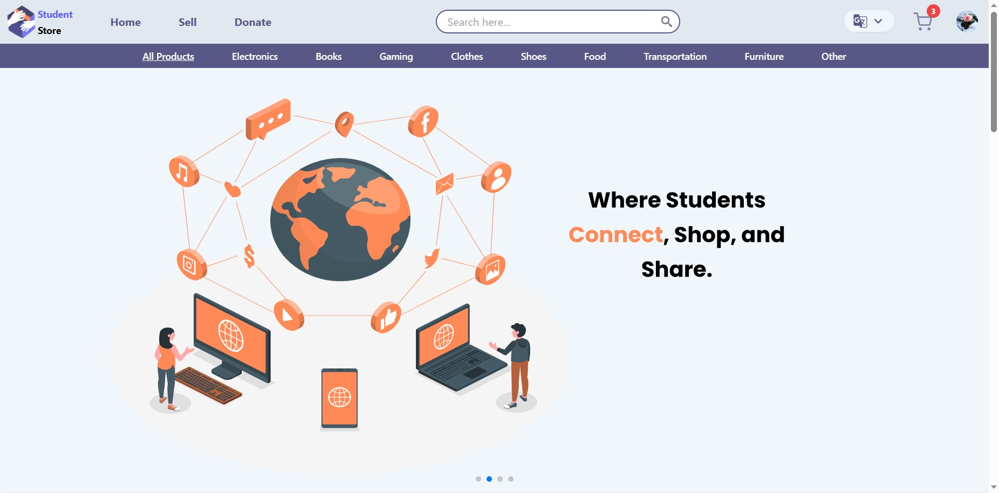
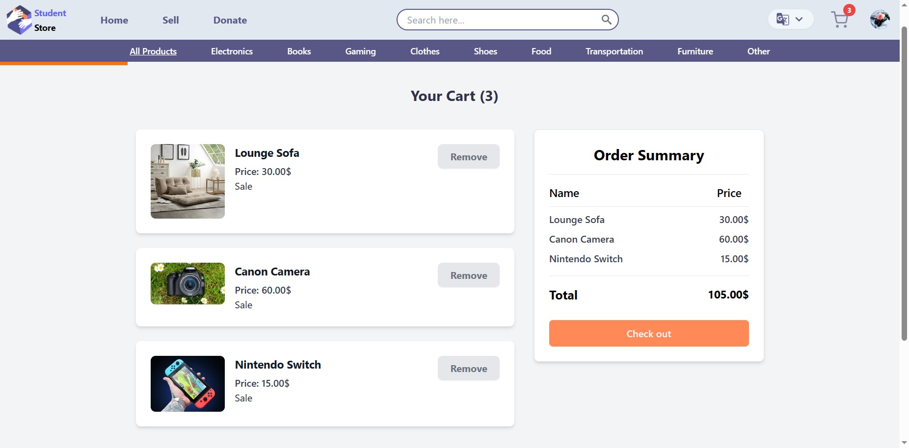
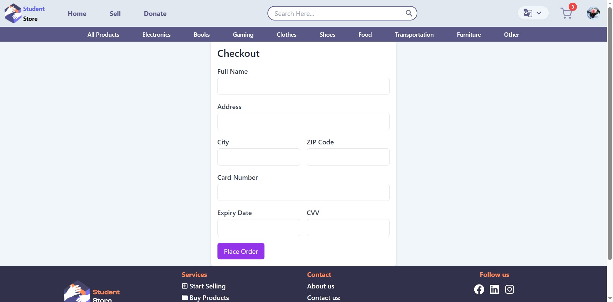
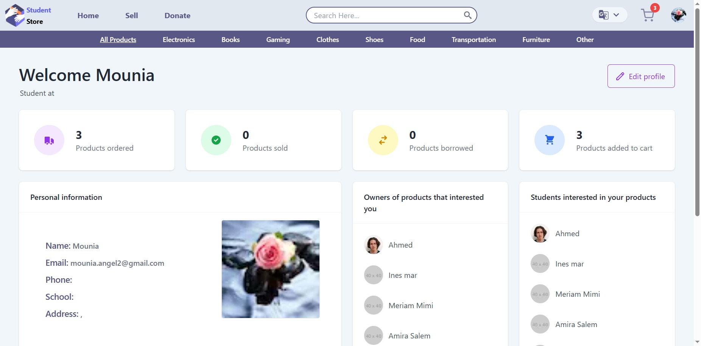
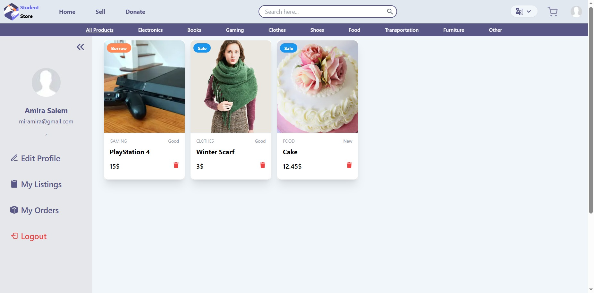
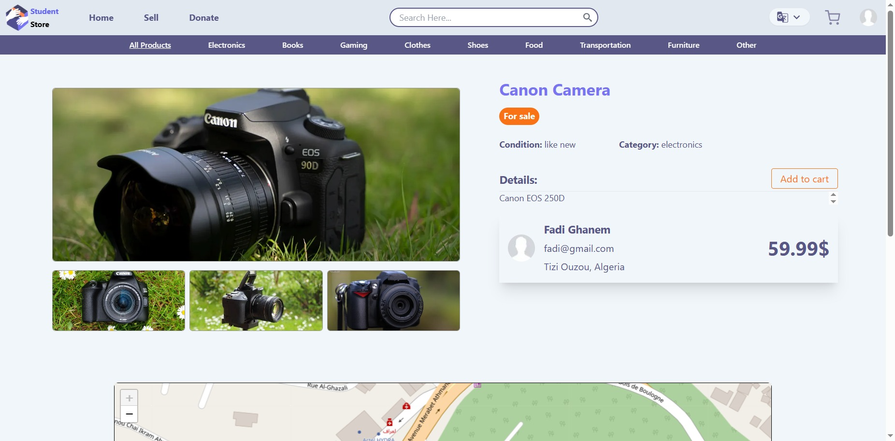

# Student Store - Capstone project

## WEBSITE DETAILS:

### Outline and objective:

The purpose of this website is to create a marketplace for students to sell, buy, or borrow cheap and used products. The objective is to provide a platform where students can easily list and fulfill their product needs.

### Brief Concept:

The website is a marketplace exclusively designed for students. It facilitates the buying, selling, and borrowing of various products, including electronics, games, and study books. The focus is on affordability, with most products being cheap and used.

### Target Audience:

Students of all ages, genders, and locations. The language of the platform is tailored for students.

### Three Words to Describe:

Only For Students.

## Features and Functionality:

1. **User Authentification:**
    - Student account creation and management.
    - Secure sign-in and sign-up processes.
2. **Product Management:**
    - Easy product listing with image upload functionality.
    - Intuitive product categorization (electronics, games, study books).
    - Search and filtering options (e.g., by price).
3. **Donation Page:**
    - Facilitate a page for users willing to donate items.
    - Encourage a sense of community and support.
4. **User Profiles:**
    - Robust user profile management.
    - Option to view and edit personal information.
    - Track and manage listed products.
5. **Multi-language Support:**
    - Website content available in English, Arabic, and French.
    - Enhance accessibility and inclusivity.
6. **Responsive Design:**
    - Compatible with desktop, tablet, and mobile devices.
    - Unique user experience across various screen sizes.
7. **Internationalization (i18n):**
    - Implement i18n for seamless translation of content.
    - Enhance the user experience for speakers of different languages.
8. **Technology Stack:**
    - Nextjs for a fast and efficient frontend.
    - TailwindCSS for a modern and responsive design.
    - DaisyUi for UI components.
    - Firebase for backend and database management.
    - Husky, Prettier, Eslint, Commitlinter for code quality and version control.

### Content:

-   Student account creation and management
-   Product listing and image upload
-   Product browsing and filtering (e.g., by price)
-   Donation page
-   User profile management
-   Listing management
-   Profile information page
-   User's listings page
-   User's orders page
-   Cart management
-   Checkout process
-   Internationalization
-   Responsive design

## Devices:

-   Desktop
-   Tablet
-   Mobile

## Project Contributors

-   Benarba Tewfik,
-   Hocine Benouddane,
-   Katia Ghezali,
-   Mounia Belkheir,
-   Sami Babouche,
-   Khaoula Aourra

## Additional Details:

-   The platform encourages a sense of community by providing a donation page.
-   Affordability and usability are emphasized to cater to the student audience.
-   Regular code quality checks and enhancements are implemented using Husky, Prettier, Eslint, and Commitlinter.
-   The platform is designed to be easily navigable on different devices, enhancing user accessibility.

## Bootcamp Information:

Re:Coded - NEA DZ FEW 2023

## Screenshots:

