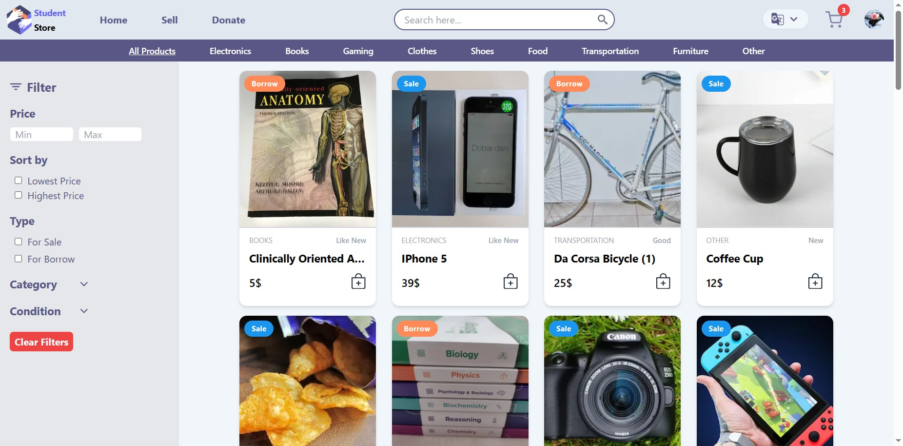

# Capstone project information

## Project Title: Student Store

## WEBSITE DETAILS:

**Outline and objective:**

The purpose of this website is to create a marketplace for students to sell, buy, or borrow cheap and used products. The objective is to provide a platform where students can easily list and fulfill their product needs.

**Brief Concept:**
The website is a marketplace exclusively designed for students. It facilitates the buying, selling, and borrowing of various products, including electronics, games, and study books. The focus is on affordability, with most products being cheap and used.

**Target Audience:**
Students of all ages, genders, and locations. The language of the platform is tailored for students.

**Three Words to Describe:**
Only For Students

**Content:**

-   Student account creation and management
-   Product listing and image upload
-   Product browsing and filtering (e.g., by price)
-   Donation page
-   User profile management
-   Listing management
-   Profile information page

**Devices:**

-   Desktop
-   Tablet
-   Mobile

**Technology Used:**

Nextjs, TailwindCSS, DaisyUi, Firebase, i18next, Husky, Prettier, Eslint, Commitlinter (Conventional Commits)

**Display Language:**

-   English
-   Arabic
-   French

**Project Contributors**

-   Benarba Tewfik,
-   Hocine Benouddane,
-   Katia Ghezali,
-   Mounia Belkheir,
-   Sami Babouche,
-   Khaoula Aourra

**Bootcamp:**
NEA DZ FEW 2023

**Screenshots:**

